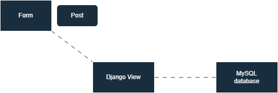
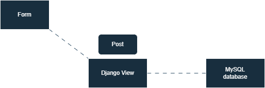
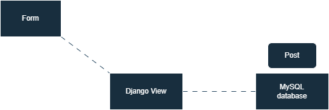

# Django Forms

Django Forms following the server-first approach.

## Let's briefly outline what the process will involve

1. The form will be updated by an API endpoint.

     

2. Uses a post method to send a request to the Django view.

     

3. The entered user data or comment is then added to a MySQL database which was created earlier using models in Django.

     

> So, using the dom event type in JavaScript called addEventListener and fetch API in JavaScript, you make a POST request to the forms action URL before converting it into JSON data and sending it to the database.
